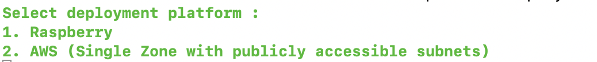
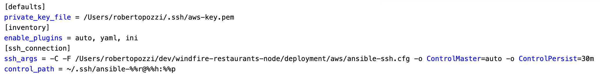
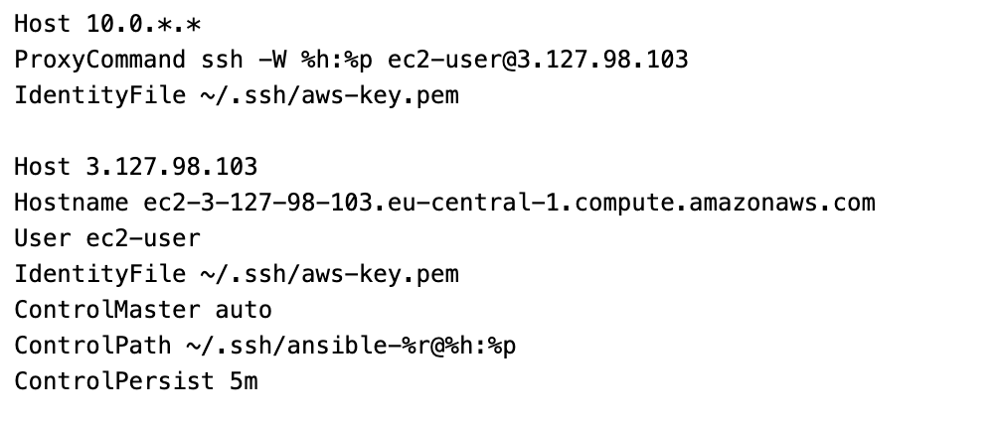
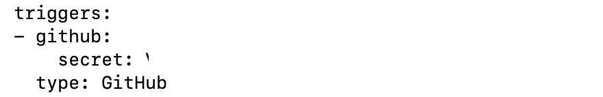
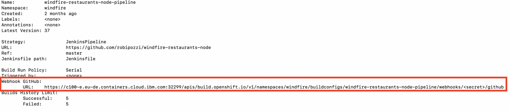
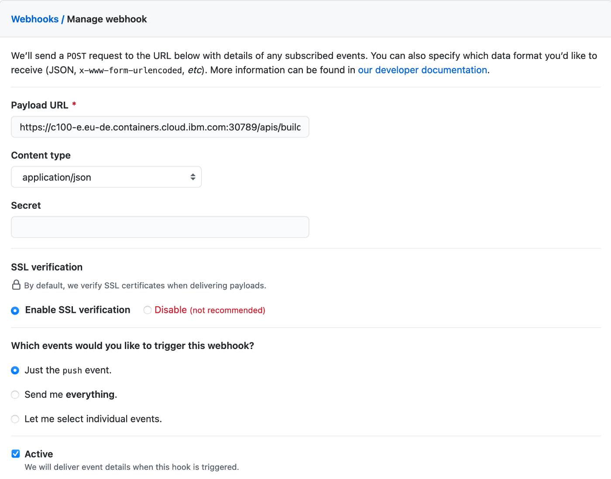

# Windfire Restaurants Backend (Node.js version)
- [Overview](#overview)
- [Before you start](#before-you-start)
- [Run microservice on local](#run-microservice-on-local)
- [Target architectures and deployment automation](#target-architectures-and-deployment-automation)
  - [Raspberry deployment](#raspberry-deployment)
  - [AWS deployment](#aws-deployment)
  - [OpenShift deployment](#openshift-deployment)
    - [OpenShift Template](#openshift-template)
    - [OpenShift Pipeline](#openshift-pipeline)
    - [Jenkins Pipeline](#jenkins-pipeline)

## Overview
This repository contains the code for the backend microservice of my *Windfire Restaurants* application, along with scripts, playbooks and configurations to automate application run and deployment to target infrastructures.

It is a simple microservice, running on Node.js, that serves a basic Welcome html page and exposes 2 REST endpoints:
* */healthz* endpoint - it returns a string, testing that the application is up and healthy
* */restaurants* endpoint - it returns a list of restaurants in Json format

## Before you start
Ensure all the prerequisite software is installed:
* *Node.js* - installation instructions are available for different platforms at *https://nodejs.org/en/download/*. The application has been developed and tested with Node.js v12.14.1.
* *npm* - Node.js Package Manager is distributed with Node.js, which means that when you download Node.js, you automatically get npm installed on your computer. The application has been developed and tested with npm v6.13.4.

Clone this repository 
```
mkdir $HOME/dev
cd $HOME/dev
git clone https://github.com/robipozzi/windfire-restaurants-node
```

Before starting to use and test this microservice you also need to create a **config.properties** file in *app/config* folder and fill it with appropriate parameter values for the desired environment. A placeholder config properties file, named [config_PLACEHOLDER.properties](app/config/config_PLACEHOLDER.properties) is stored in this repository for convenience.

## Run microservice on local
This microservice can be run locally by simply launching **[app-run.sh](app/app-run.sh)** script, available in the */app* folder.

```
cd $HOME/dev/windfire-restaurants-node/app
./app-run.sh
```

## Target architectures and deployment automation
*Windfire Restaurants Backend* microservice can be deployed to different kind of infrastructures; automation procedures are provided in this repository for Raspberry, AWS and Red Hat OpenShift.

**WARNING: OpenShift pre-requisites**: in case of deployment to Red Hat OpenShift, you firstly need to configure Service Accounts for build and deployment appropriately, following [these instructions](#openshift-architecture).

The **[deploy.sh](deploy.sh)** and **[undeploy.sh](undeploy.sh)** scripts are provided to run deployment/undeployment automation tasks, as it can be seen in the figure below.

```
cd $HOME/dev/windfire-restaurants-node/
./deploy.sh
```



The scripts currently expose 5 deployment/undeployment options:
* *Raspberry* : it automates *Windfire Restaurants Backend* microservice deployment/undeployment in a Raspberry Pi target architecture;
* *AWS Single Zone* : it automates *Windfire Restaurants Backend* microservice deployment to an AWS architecture with publicly accessible Frontend and Backend subnets in a single availability zone
* *AWS Multi Zone* : it automates *Windfire Restaurants Backend* microservice deployment to an AWS architecture with Frontend and Backend subnets in a variable number of availability zones to create a Fault Tolerant architecture
* *OpenShift (using Template)* : it automates *Windfire Restaurants Backend* microservice deployment to an OpenShift cluster, using a Template
* *OpenShift (using OpenShift Pipeline)* : it automates *Windfire Restaurants Backend* microservice deployment to an OpenShift cluster, running an OpenShift Pipeline. 

Another deployment automation strategy is also available, based on Jenkins, details on how to implement and use it are in [Jenkins pipeline](#jenkins-pipeline) paragraph.

### Raspberry deployment
Automation is implemented using Ansible technology (https://www.ansible.com/): refer to Ansible technical documentation (https://docs.ansible.com/) for detailed instructions regarding installation and setup.

A file, named **[ansible.cfg](deployment/raspberry/ansible.cfg)**, is provided in *deployment/raspberry* folder to set basic configurations needed to run Ansible: **[deploy.sh](deploy.sh)** and **[undeploy.sh](undeploy.sh)** scripts set ANSIBLE_CONFIG environment variable pointing to this file; the basic configuration you should have is something like this:


where:

* *inventory* defines where Ansible will look for the inventory file, which is used by Ansible to know which servers to connect and manage;
* *private_key_file* points to the SSH private key used by Ansible to connect and launch tasks on the target infrastructure.

Change the parameters according to your environment.

The scripts wrap Ansible to automate deployment tasks, using the Ansible provided playbook **[deploy.yaml](deployment/raspberry/deploy.yaml)** for deployment and the Ansible provided playbook **[remove.yaml](deployment/raspberry/remove.yaml)** for microservice undeployment.

### AWS deployment
AWS target deployment environment is based on the following Architecture


*Windfire Restaurant Backend* microservice is deployed to an EC2 instance placed in the Backend subnet. 

For security reasons, either the Frontend and Backend subnets are not directly accessible via SSH. Ansible automation script is configured to connect to the target hosts via a Bastion Host, conveniently placed in the Management subnet.

In case of deployment to AWS, since the Cloud architecture is more dynamic by nature, the **[deploy.sh](deploy.sh)** and **[undeploy.sh](undeploy.sh)** scripts delegate to **[ansible-config.sh](deployment/aws/ansible-config.sh)** script in *deployment/aws* folder the dynamic definition of 2 files that are used by Ansible:

* *ansible-aws.cfg*, which dynamically sets Ansible configuration. An example of such a configuration is reported in the following figure



* *ansible-ssh.cfg*, which sets SSH configurations to allow Ansible to connect to Frontend and Backend instances, through the Bastion Host. An example of such a configuration is reported in the following figure



The scripts wrap Ansible to automate deployment tasks, using the Ansible provided playbook **[deploy.yaml](deployment/aws/deploy.yaml)** for deployment and the Ansible provided playbook **[remove.yaml](deployment/aws/remove.yaml)** for microservice undeployment.

### OpenShift deployment
Deployment of *Windfire Restaurants* application component to OpenShift is supported in the following 3 ways:
- [Using an OpenShift Template](#openshift-template) : this deployment strategy runs a script which uses an OpenShift Template
- [Running an OpenShift pipeline](#openshift-pipeline) : this deployment strategy creates an OpenShift pipeline that can be run to deploy the application component to the cluster
- [Running a Jenkins pipeline](#jenkins-pipeline) : this deployment strategy creates a Jenkins pipeline that can be run to deploy the application component to the cluster

Scripts and instructions are provided for each deployment strategy

#### OpenShift Template
Before deploying the application to OpenShift you firstly need to run **[create-github-secret.sh](deployment/openshift/create-github-secret.sh)** script, which creates a Secret that allows deployment procedures to access and clone source code repository even in case GitHub repo is private and not publicly accessible.

```
cd $HOME/dev/windfire-restaurants-node/deployment/openshift
./create-github-secret.sh
```

Once you have created the GitHub Secret, you can run **[deploy.sh](deploy.sh)** 

```
cd $HOME/dev/windfire-restaurants-node
./deploy.sh
```

The script delegates to **[oc-deploy.sh](deployment/openshift/oc-deploy.sh)** script, which then runs an **oc new-app** command using **[windfire-restaurants-backend-template.yaml](deployment/openshift/windfire-restaurants-backend-template.yaml)** OpenShift Template; the template defines and creates all the following objects:

* *ImageStream* that references the container image in OpenShift Internal Registry
* *BuildConfig* of type Git that uses *nodejs:10-SCL* Source-to-Build image to build from source code
* *DeploymentConfig* that defines how the application is deployed to OpenShift cluster
* *Service* of type ClusterIP that exposes required ports and allows to interact with the running pods from within the OpenShift cluster
* *Route* that exposes the Service outside the OpenShift cluster

##### Update application with triggers and GitHub Webhooks
Once you have deployed the application, it is possible to use GitHub Webhooks to trigger automatic application deployment updates whenever a change is pushed to tht GitHub repository. 

Ensure a GitHub trigger is enabled on the BuildConfig by issuing the following command

```
oc set triggers bc/windfire-restaurants-backend --from-github
```

This will allow the BuildConfig to be triggered by a webhook that is configured on GitHub.

Firstly you need to get the secret that is automatically generated when the *from-github* trigger is set on the BuildConfig, with the following command:

```
oc edit bc/windfire-restaurants-backend
```

You should find something like the following, write down the secret, you will need it in a second.



Then find the GitHub Webhook URL with the following command:

```
oc describe bc/windfire-restaurants-backend
```

You should find something similar to the following, write down the URL, replace <secret> with the actual secret you found before and write it down, you will need it when you are going to configure Webhooks in GitHub.



Now we have everything we need to set a Webhook trigger in GitHub.

Go to the GitHub repo, click on Settings, then Webhooks, click on Add Webhook button and configure it appropriately: set Payload URL to the Webhook URL you noted down before, just like the following:



With this, every time a commit is pushed to GitHub, the webhook will be triggered running the BuildConfig and updating the application.

#### OpenShift pipeline
Red Hat OpenShift Pipelines is a cloud-native continuous integration and delivery (CI/CD) solution for building pipelines using [Tekton](https://tekton.dev/).

Tekton is a flexible Kubernetes-native open-source CI/CD framework, which enables automating deployments across multiple platforms (Kubernetes, serverless, VMs, etc) by abstracting away the underlying details.

Refer to Red Hat OpenShift official documentation (https://docs.openshift.com/container-platform/4.6/pipelines/creating-applications-with-cicd-pipelines.html) for more info about OpenShift Pipelines.

##### Before you start
Before experimenting with OpenShift Pipelines, you need to take 2 preparatory steps:
1. [Install OpenShift Pipelines](#install-openShift-pipelines) on your OpenShift cluster (pretty obvious !!!).
2. [Create a Service Account](#configure-service-account) and configure it appropriately.

##### Install OpenShift Pipelines
Go to OpenShift web console, select **Operators** -> **Operators Hub** from the navigation menu on the left of your OpenShift web console and then search for the OpenShift Pipelines Operator.


Click on the tile and then the subsequent Install button.


Keep the default settings on the Create Operator Subscription page and click Subscribe.

##### Configure Service Account
To make sure the pipeline has the appropriate permissions to store images in the local OpenShift registry, we need to create a service account by running **[create-serviceaccount.sh](deployment/openshift/create-serviceaccount.sh)** script. We'll call it **pipeline**.

```
cd $HOME/dev/windfire-restaurants-node/deployment/openshift
./create-serviceaccount.sh
```

Running **[create-serviceaccount.sh](deployment/openshift/create-serviceaccount.sh)** script does everything that is needed:
- it sets context to the OpenShift project selected (the project is automatically created if it does not pre-exist)
- it creates a **pipeline** Service Account
- it adds a **privileged** Security Context Constraint to pipeline account
- it adds an **edit** Role to pipeline account
- it creates a Secret for GitHub credentials, annotates with **"tekton.dev/git-0=https://github.com"** and links it to **pipeline** Service Account
- it creates a Secret for Quay credentials, annotates with **"tekton.dev/docker-0=quay.io"** and links it to **pipeline** Service Account
- it links Secret for Quay credentials to **default** Service Account for pull

##### Run OpenShift pipeline
Run **[create-pipeline.sh](deployment/openshift/tekton/create-pipeline.sh)** script to create the Pipeline and all the needed PipelineResources in your OpenShift cluster.

```
cd $HOME/dev/windfire-restaurants-node/deployment/openshift/tekton
./create-pipeline.sh
```

The script does the following:

1. It uses **[pvc.yaml](deployment/openshift/tekton/pvc.yaml)** file to create:
    - *windfire-restaurants-pvc* PersistentVolumeClaim, which provides data storage and binds it to the Workspace. This PersistentVolumeClaim provides the volumes or filesystem required for the Pipeline execution.

    **WARNING:** ensure the PersistentVolumeClaim is bound before trying to run the pipeline.
2. It uses **[windfire-restaurants-backend-pipeline.yaml](deployment/openshift/tekton/windfire-restaurants-backend-pipeline.yaml)** file to create:
    - *windfire-restaurants-node-git* PipelineResources, which configures the GitHub repository from which *windfire-restaurants* application source code is taken
    - *windfire-restaurants-node-image* PipelineResources, which defines the container image that gets created within OpenShift internal registry
    - *windfire-restaurants-backend* Pipeline, which defines all the steps to build and deploy the *vote* application components

The Pipeline performs the following tasks for the back-end application *vote*:
- Clones the source code of the application from the Git repository by referring to the git-url and git-revision parameters.
- Builds the container image and pushes it to container registry using *buildah* ClusterTask.
- Deploy the image to OpenShift wrapping an *oc new-app* command using *openshift-client* ClusterTask.
- Expose a Route wrapping an *oc expose* command using *openshift-client* ClusterTask.

Once you have created the Pipeline, you can launch **[run-pipeline.sh](deployment/openshift/tekton/run-pipeline.sh)** script to run the pipeline.

```
cd $HOME/dev/windfire-restaurants-node
./deploy.sh 5
```

The script uses **[windfire-restaurants-backend-pipelinerun.yaml](deployment/openshift/tekton/windfire-restaurants-backend-pipelinerun.yaml)** file to run the Pipeline using the previously created PipelineResources:
- *windfire-restaurants-node-git*: https://github.com/robipozzi/windfire-restaurants-node
- *windfire-restaurants-node-image*: image-registry.openshift-image-registry.svc:5000/windfire/vote-api:2.0

Alternatively you can obviously go to OpenShift web console and start the pipeline from the GUI.

##### Remove application from OpenShift
Run **[undeploy.sh](undeploy.sh)** script with option 3 to undeploy the application, removing all the related OpenShift objects.

```
cd $HOME/dev/windfire-restaurants-node/
./undeploy.sh 3
```

##### Delete OpenShift pipeline
Run **[delete-pipeline.sh](deployment/openshift/tekton/delete-pipeline.sh)** script to delete Pipeline and PipelineResources at once.

```
cd $HOME/dev/windfire-restaurants-node/deployment/openshift/tekton
./delete-pipeline.sh
```

#### Jenkins pipeline
To use this approach, you will firstly need to have access to a Jenkins instance and configure it appropriately; refer to my other GitHub repository https://github.com/robipozzi/devops/blob/master/Jenkins/README.md for instructions on how to setup and configure Jenkins on OpenShift itself.

A BuildConfig definition of type JenkinsPipeline is defined in **[buildconfig.yaml](deployment/openshift/jenkins/buildconfig.yaml)** to allow using Jenkins to automate build and deployment to OpenShift. 

Run **[create-buildconfig.sh](deployment/openshift/jenkins/create-buildconfig.sh)** to create the *BuildConfig* object, that can then be used to start Builds.

```
cd $HOME/dev/windfire-restaurants-node/deployment/openshift/jenkins
./create-buildconfig.sh
```

The BuildConfig then delegates the actual build and deployment steps to this **[Jenkinsfile](Jenkinsfile)**. 